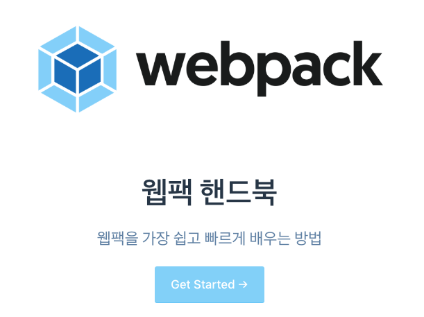

<p align="center"><a href="https://joshua1988.github.io/webpack-guide/" target="_blank" rel="noopener noreferrer"></a></p>

<p align="center"><strong>The easiest way to learn Webpack</strong></p>

# Webpack Guide

This repository is for the [Webpack Handbook](https://joshua1988.github.io/
webpack-guide/) in Korean.

## Contribution to this Project

Feel free to ask any questions related with the topics on the web site. Please open an issue following these guidelines.

더 알고 싶은 내용이나 현재 사이트에서 수정되어야 하는 부분이 있다면 [깃헙 이슈](https://github.com/joshua1988/webpack-guide/issues)로 편하게 제기해주세요. 이슈 예시는 아래 형식을 따라주시면 됩니다 😄

```
# issue example - adding contents
title : [내용 추가 요청] 웹팩 watch 옵션에 대해서 알고 싶습니다.
contents : 어떻게 하면 watch 옵션을 설정할 수 있나요?
```

```
# issue example - fixing the wrong info
title : [수정 요청] 웹팩 플러그인 설명이 잘못된 것 같습니다.
contents : 플러그인 속성 이름이 `plugin`이 아니라 `plugins`가 되어야 할 것 같습니다.
```

## Backers

<a href="https://www.patreon.com/user/creators?u=25436476" target="_blank"></a>
<a href="https://www.patreon.com/user/creators?u=25480524" target="_blank"></a>

## License & Copyright

**Copyright © 2019 Captain Pangyo**

<a rel="license" href="http://creativecommons.org/licenses/by-nc-nd/4.0/"></a><br />This work is licensed under a <a rel="license" href="http://creativecommons.org/licenses/by-nc-nd/4.0/">Creative Commons Attribution-NonCommercial-NoDerivs 4.0 Unported License</a>.

