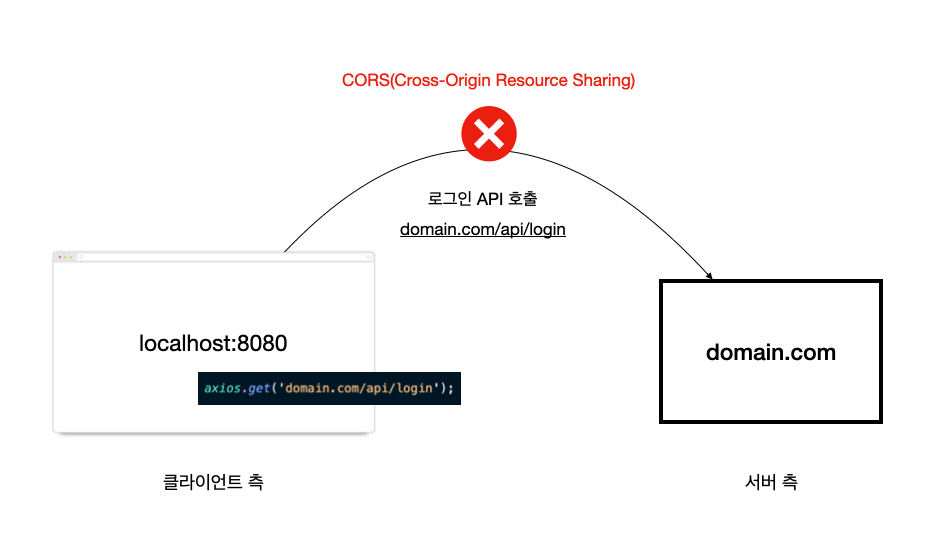

## Webpack Dev Server

웹팩 데브 서버는 웹 애플리케이션을 개발하는 과정에서 유용하게 쓰이는 도구입니다. 웹팩의 빌드 대상 파일이 변경 되었을 때 매번 웹팩 명령어를 실행하지 않아도 코드만 변경하고 저장하면 웹팩으로 빌드한 후 브라우저를 새로고침 해줍니다.

매번 명령어를 치는 시간과 브라우저를 새로 고침하는 시간 뿐만 아니라 웹팩 빌드 시간 또한 줄여주기 때문에 웹팩 기반의 웹 애플리케이션 개발에 필수로 사용됩니다.

## 웹팩 데브 서버의 특징

웹팩 데브 서버는 일반 웹팩 빌드와 다른점이 있습니다. 먼저 명령어를 보겠습니다.

```json
"scripts": {
  "dev": "webpack serve",
  "build": "webpack"
}
```

웹팩 데브 서버를 실행하여 웹팩 빌드를 하는 경우에는 빌드한 결과물이 파일 탐색기나 프로젝트 폴더에서 보이지 않습니다. 좀 더 구체적으로 얘기하자면 웹팩 데브 서버로 빌드한 결과물은 메모리에 저장되고 파일로 생성하지는 않기 때문에 컴퓨터 내부적으로는 접근할 수 있지만 사람이 직접 눈으로 보고 파일을 조작할 순 없습니다.

따라서, 웹팩 데브 서버는 개발할 때만 사용하다가 개발이 완료되면 웹팩 명령어를 이용해 결과물을 파일로 생성해야 합니다.

:::tip
컴퓨터 구조 관점에서 파일 입출력보다 메모리 입출력이 더 빠르고 컴퓨터 자원이 덜 소모됩니다 😄
:::

위 설명이 잘 이해가 안 간다면 [튜토리얼](/tutorials/webpack-dev-server.html)을 직접 해보면서 확인해보세요.

## 프록시(Proxy) 설정

프록시 설정은 실무에서 가장 흔하게 사용하는 속성입니다. 아래와 같이 선언합니다.

```js
// webpack.config.js
module.exports = {
  devServer: {
    proxy: {
      '/api': 'http://localhost:3000'
    }
  }
};
```

위와 같이 설정하고 나면 로컬 웹팩 데브 서버에서 발생하는 API 요청에 변화가 생깁니다. 그림으로 살펴보겠습니다. 먼저 프록시를 쓰지 않았을 때의 기본적인 웹팩 데브 서버와 API 서버의 통신 구조입니다.



여기서 [CORS](https://developer.mozilla.org/en-US/docs/Web/HTTP/CORS)라는 용어가 나옵니다. 이 용어는 브라우저 보안과 관계가 있는데요. 쉽게 얘기하면 다른 도메인 간에는 자바스크립트로 자원을 요청할 수 없다는 의미입니다. 위 그림에서도 서버에 로그인 관련 API 요청을 했는데 CORS 오류가 나는 걸 볼 수 있습니다.

뷰, 리액트와 같은 프런트엔드 프레임워크를 쓰면 개발 편의상 로컬에 웹팩 데브 서버를 띄워놓고 개발하는 경우가 많습니다. 이 때, 이러한 문제를 해결하기 위해서 아래와 같이 프록시 속성을 설정하면 서버에서 해당 요청을 받아줍니다.

```js
module.exports = {
  devServer: {
    proxy: {
      '/api': 'domain.com'
    }
  }
};
```


CORS가 브라우저 보안과 관련있기 때문에 브라우저에서 벗어나 서버에서 서버로 요청합니다. 실제로 브라우저에서는 `localhost:8080/api/login` 으로 요청했지만 중간에 프록시 서버의 활약으로 `domain.com` 서버에서는 같은 도메인(domain.com)에서 온 요청으로 인식하여 CORS 에러가 나지 않습니다.